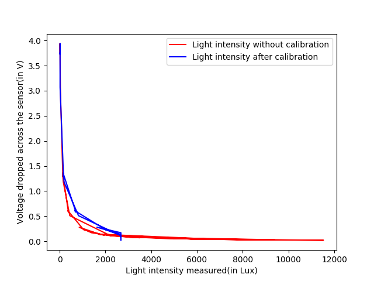

## Arduino Assignment 2

This project deals with using arduino to study about sensors.

### Light Dependant Registers(LDR)

Light Dependant Registers (LDR's ) vary their resistance with the intensity of light falling on them.We use this as a sensor in the below circuit to vary the voltage being dropped over it. The varying voltage reading is passed on to a PWM pin to light up an LED to display the changes.


## The setup
We build the following circuit for controlling the LED lighting using the LDR.


The LDR is put in series with a 10k ohms resistor. The voltage divider is connected to the pin number A0 of arduino.
The signal received at A0 is passed to PWM pin nummber 14 which lights the LED. 

### Calculating the light Intensity
We can calculate the value of the light intensity using the below formula.
```
Lux = 500/(Value of Resistor in KOhms)
We can calculate the resistance value using the voltage observed in A0 and the value of the other resistor in series
Lux = (500.0000 * Voltage_A0)/ (Resistor(value in kOhms) *(TotalVoltage -Voltage_A0 ));
```

### Calibration
For calibratiing out sensor I have used an app in my phone to observe the accurate value of light intensity at the same lighting conditions.After multiple observations we obtained the calibration data.This data is fed into the ```FmultiMap``` to get the calibrated value of sensor.

## Data observed
The value of Voltage dropped at the sensor ranges from  `0.2 V to 3.9 V`.
The value of Resistance observed ranges from `43.2 Ohms to 4883.2 Ohms`.
The following graph is observed.




## Arduino scheme

```
 
int photocellPin = 0;     // the cell and 10K pulldown are connected to a0
int photocellReading;     // the analog reading from the sensor divider
int LEDpin = 11;          // connect Red LED to pin 11 (PWM pin)
int LEDbrightness;
float TotalVoltage = 5.0000;
float Voltage = 0;
float Lux = 0;
float calib_lux = 0;
float Resistance = 0; 
float in[] = {39.0,152.0,164.0,204.0,1390};
float out[] = {20.0,189.0,196.0,356.0,2677};


float FmultiMap(float val, float * _in, float * _out, uint8_t size)
{
  // take care the value is within range
  // val = constrain(val, _in[0], _in[size-1]);
  if (val <= _in[0]) return _out[0];
  if (val >= _in[size-1]) return _out[size-1];

  // search right interval
  uint8_t pos = 1;  // _in[0] allready tested
  while(val > _in[pos]) pos++;

  // this will handle all exact "points" in the _in array
  if (val == _in[pos]) return _out[pos];

  // interpolate in the right segment for the rest
  return (val - _in[pos-1]) * (_out[pos] - _out[pos-1]) / (_in[pos] - _in[pos-1]) + _out[pos-1];
}


void setup(void) {
  // We'll send debugging information via the Serial monitor
  Serial.begin(9600);   
}


void loop(void) {
  photocellReading = analogRead(photocellPin);  
 
  Serial.print("Voltage dropped accross the sensor (in V) = ");
 // Serial.println(photocellReading);     // the raw analog reading
  Voltage = .0049 * photocellReading;
  Serial.println((TotalVoltage -Voltage ));
  Resistance =  10000*(TotalVoltage -Voltage )/TotalVoltage;
  Serial.print("Resistance across the sensor (in ohms) = ");
  Serial.println(Resistance);  
// Lux = 500 * (5/Voltage - 1) / 10000
  Serial.print("Light Intensity (in lx) = ");
  Lux = (500.0000 * Voltage)/ (10 *(TotalVoltage -Voltage ));
  Serial.println(Lux); 
  Serial.print("calib_lux (in lx) = ");
  calib_lux = FmultiMap(Lux, in, out, 5);
  Serial.println(calib_lux);
  // LED gets brighter the darker it is at the sensor
  // that means we have to -invert- the reading from 0-1023 back to 1023-0
  //photocellReading = photocellReading;
  //now we have to map 0-1023 to 0-255 since thats the range analogWrite uses
  LEDbrightness = map(photocellReading, 200, 700, 0, 255);
  analogWrite(LEDpin, LEDbrightness);
 
  delay(200);
}
```

## Sample Serial output
```
Voltage dropped accross the sensor (in V) = 3.74
Resistance across the sensor (in ohms) = 7471.60
Light Intensity (in lx) = 16.92
calib_lux (in lx) = 20.00

```

