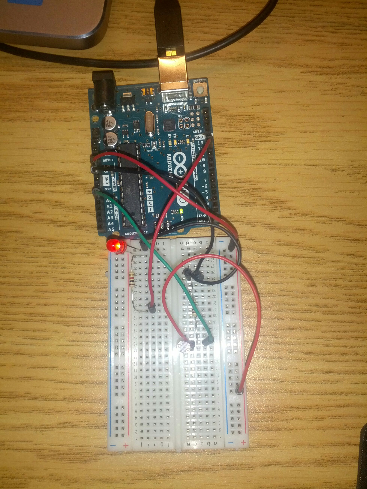
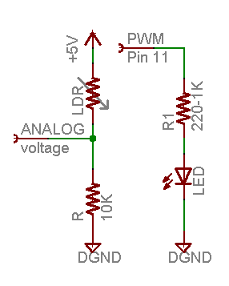
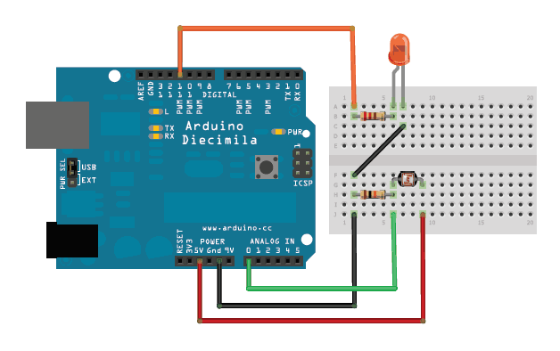

## Arduino Assignment 2

This project deals with using arduino to study about sensors.

### Light Dependant Registers(LDR)

Light Dependant Registers (LDR's ) vary their resistance with the intensity of light falling on them.We use this as a sensor in the below circuit to vary the voltage being dropped over it. The varying voltage reading is passed on to a PWM pin to light up an LED to display the changes.




## The setup
We build the following circuit for controlling the LED lighting using the LDR.



The LDR is put in series with a 10k ohms resistor. The voltage divider is connected to the pin number A0 of arduino.
The signal received at A0 is passed to PWM pin nummber 14 which lights the LED. 

### Calculating the light Intensity
We can calculate the value of the light intensity using the below formula.
'''
Lux = 500/(Value of Resistor in KOhms)
We can calculate the resistance value using the voltage observed in A0 and the value of the other resistor in series
Lux = (500.0000 * Voltage_A0)/ (Resistor(value in kOhms) *(TotalVoltage -Voltage_A0 ));
'''

### Calibration
For calibratiing out sensor I have used an app in my phone to observe the accurate value of light intensity at the same lighting conditions.After multiple observations we obtained the calibration data.This data is fed into the '''FmultiMap''' to get the calibrated value of sensor.


```markdown
Syntax highlighted code block

# Header 1
## Header 2
### Header 3

- Bulleted
- List

1. Numbered
2. List

**Bold** and _Italic_ and `Code` text

[Link](url) and 
```

For more details see [GitHub Flavored Markdown](https://guides.github.com/features/mastering-markdown/).

### Jekyll Themes

Your Pages site will use the layout and styles from the Jekyll theme you have selected in your [repository settings](https://github.com/lungiman/arduino/settings). The name of this theme is saved in the Jekyll `_config.yml` configuration file.

### Support or Contact

Having trouble with Pages? Check out our [documentation](https://help.github.com/categories/github-pages-basics/) or [contact support](https://github.com/contact) and we’ll help you sort it out.
